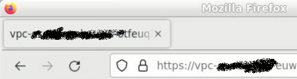
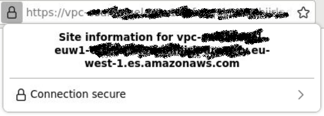
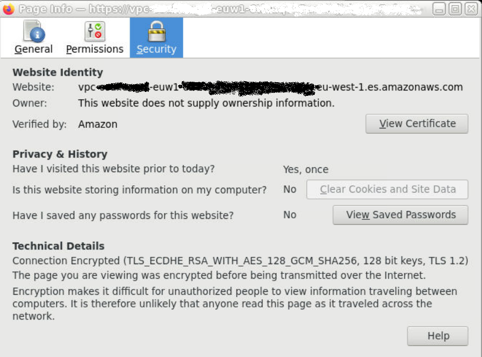
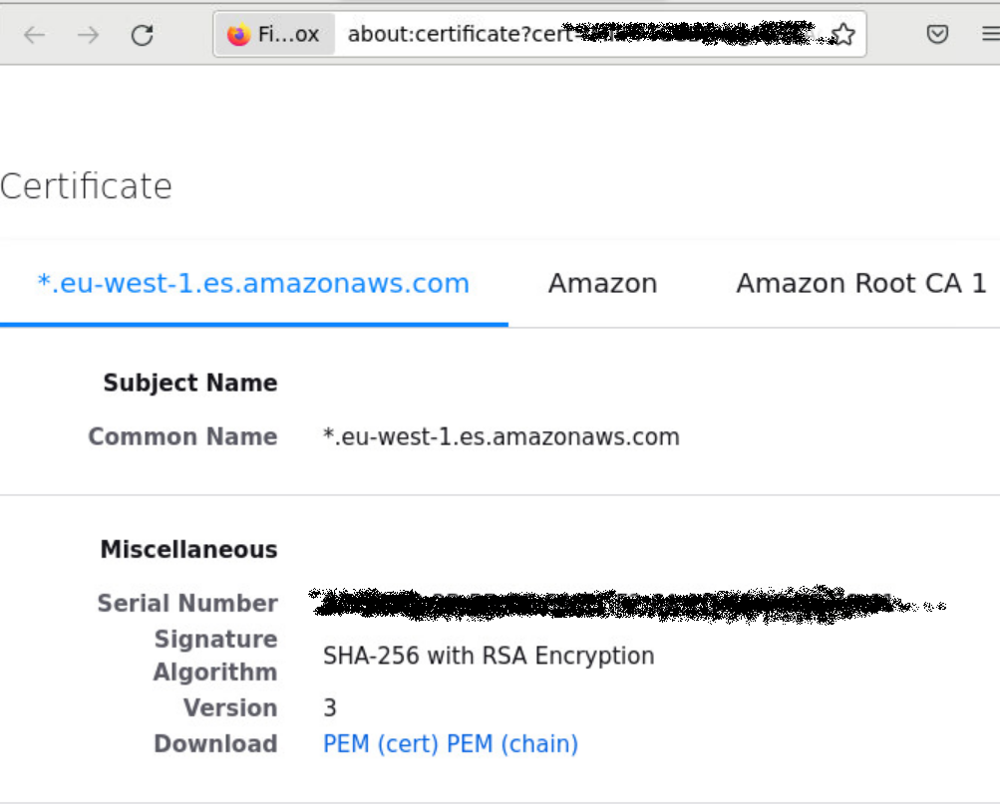

Network traffic to AWS services are generally protected SSL. Java clients accessing such services thus need to have a truststore to hold the public certificates for  AWS services they'll be accessing.

# Obtaintaining public certificates for AWS services
Public certificates can be exported with modern web browsers.

1. Enter the endpoint in the address field of the browser and connect to the service.

2. Click the lock icon to the right of the endpoint address to get the endpoint's security information

3. Click the View Certificate button

4. There are three certificates to download, one on each tab. 

# Import certificates into a new or existing truststore with keytool

For each certificate, use keytool to import it into a new or existing trusstore.

`keytool -import -alias amazon -noprompt -file nameOfCertificate1.pem -keystore nameOfTrustStore.pfx -storetype PKCS12 -storepass passwordForTruststore`

If keytool hasn't been installed in your system, it is likely that either your Java runtime environment is really old or Java isn't installed. Install java and retry.

# Listing certificates in your truststore

To check if you have certificates in your truststore, use keytool to list them

`keytool -list -keystore nameOfTrustStore.pfx  -storepass passwordForTruststore`
